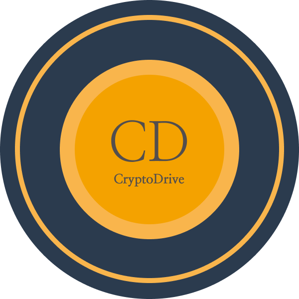

<!-- PROJECT LOGO -->
<p align="center">
  <a href="https://github.com/MLH-Fellowship/CryptoDrive">
    
  </a>

  <p align="center">
    "A Decentralised Encrypted File Storing and Sharing App which is back-boned by Ethereum Smart Contracts and is preparing its launch to the moon 🚀"
    <br /><br />
    <a href="https://mlh-fellowship.github.io/CryptoDrive/"><strong>Browse CryptoDrive</strong></a>
    <br />
    <br />
    <a href="https://en.wikipedia.org/wiki/Decentralization">What is Decentralization</a>
    ·
    <a href="https://mlh-fellowship.github.io/CryptoDrive/">Live</a>
    .
    <a href="https://github.com/MLH-Fellowship/CryptoDrive/issues">Report Bug</a>
    ·
    <a href="https://github.com/MLH-Fellowship/CryptoDrive/issues">Request Feature</a>
  </p>
</p>
<center>

[](https://github.com/MLH-Fellowship/CryptoDrive/actions/workflows/integration.yml)&nbsp;&nbsp;[](https://github.com/MLH-Fellowship/CryptoDrive/actions/workflows/deployment.yml) </center>

<!-- TABLE OF CONTENTS -->

## Table of Contents

- [About the Project](#about-the-project)
  - [Usage Guidelines](#usage-guidelines)
  - [Built With](#built-with)
- [Project Architecture](#project-architecture)
- [Getting Started](#getting-started-as-contributor)
  - [Prerequisites](#prerequisites)
  - [Installation](#installation)
- [Roadmap](#roadmap)
- [IRC and Conversations](#irc-and-conversations)
- [Contact](#admins)


<!-- ABOUT THE PROJECT -->

## About The Project

A Decentralised Encrypted File Storing and Sharing App which is back-boned by Ethereum Smart Contracts. 
<br/>
Make sure, you have [Metamask](https://metamask.io/download.html) extension installed on your browser.
<br/>
You can  use it live here: <a href="https://mlh-fellowship.github.io/CryptoDrive">CryptoDrive</a>


<!-- Extensions Required -->
### Usage Guidelines.

To use CryptoDrive ,<strong> Metamask </strong> browser extension is required. You can download it for [Chrome](https://chrome.google.com/webstore/detail/metamask/nkbihfbeogaeaoehlefnkodbefgpgknn?hl=en), [Firefox](https://addons.mozilla.org/en-US/firefox/addon/ether-metamask/), [Brave](https://chrome.google.com/webstore/detail/metamask/nkbihfbeogaeaoehlefnkodbefgpgknn?hl=en), [Edge](https://microsoftedge.microsoft.com/addons/detail/metamask/ejbalbakoplchlghecdalmeeeajnimhm?hl=en-US) 


### Built With

- [IPFS](https://ipfs.io/)
- [Infura](https://infura.io/)
- [Solidity](https://docs.soliditylang.org/en/v0.8.3/)
- [React](https://reactjs.org/)
- [Ethereum Smart Contracts](https://www.investopedia.com/terms/s/smart-contracts.asp)


<!-- Project Breakdown -->
## Project Architecture 

```js
Architecture and Figma need to be added here
```

<!-- GETTING STARTED -->

## Getting Started as Contributor

To get a local copy up and running follow these simple steps.

### Prerequisites

This is an example of how to list things you need to use the software and how to install them.

- npm

```sh
npm install npm@latest -g
```

### Installation

1. Clone the repo

```sh
git clone https://github.com/MLH-Fellowship/CryptoDrive.git
```

2. Install NPM packages

```sh
npm install
```
3. Run Locally

```sh
npm run start
```
<!-- ROADMAP -->

## Roadmap

See the [open issues](https://github.com/MLH-Fellowship/CryptoDrive/issues) for a list of proposed features (and known issues).

<!-- CONTRIBUTING -->

## IRC and Conversations

- We recommend Blockchain beginners, to go through tutorials by CryptoZombies and Dapp University
If you are familiar with blockchain 

- For front-end we are using ReactJS at core, you need to have a decent proficiency in React to contribute to the project.
- For queries and other conversations. Join us on Discord.

```
Will Put Discord Link Here
```

## Admins
Important decisions regarding the project are taken by the following maintainer.

| Kamesh  | Abir  | Sameer  |
|---|---|---|
|      |   |  |
| [@ksdkamesh99](https://github.com/ksdkamesh99)  | [@imabp](https://github.com/imabp/)     | [@Sameerkash](https://github.com/Sameerkash)  |


## Deployment
<a href="https://mlh-fellowship.github.io/CryptoDrive/"></a>
